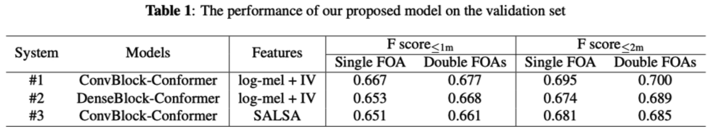
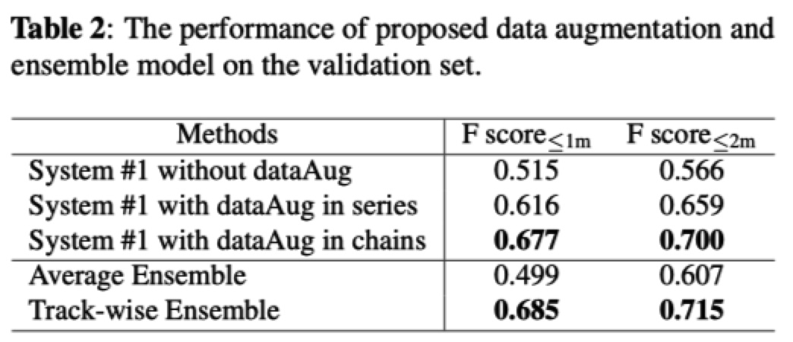

# A Track-Wise Ensemble Event Independent Network for Polyphonic Sound Event Localization and Detection

This repository contains the L3DAS22 Challenge Task 2 code for our paper: A Track-Wise Ensemble Event Independent Network for Polyphonic Sound Event Localization and Detection [1]. 

For more information about the challenge, please refer to [*L3DAS22 website*](https://www.l3das.com/icassp2022/index.html).


## Introduction

This is a PyTorch implementation of proposed method.

We have proposed a track-wise ensemble event independent network with a novel data augmentation approach for 3D polyphonic sound event localization and detection.  For more information, please read papers [hear](*Citing*).

The features of this method are following:

-  The proposed model is based on our previous proposed Event-Independent Network V2 [2,3] and is extended by conformer blocks and dense blocks. 

-  The track-wise ensemble model with track-wise output format is proposed to solve an ensemble model problem for track-wise output format that track permutation may occur among different models. 

-  The data augmentation approach contains several data augmentation chains, which are composed of random combinations of several data augmentation operations.

-  The method also utilizes log-mel spectrograms and intensity vectors (logmel&IV), and Spatial Cues-Augmented Log-Spectrogram ([*SALSA*](https://github.com/thomeou/SALSA)) for different models.

Currently, the code is avaliable for [*L3DAS21 Dataset*](https://zenodo.org/record/4642005#.Yg420K_itm8) and [*L3DAS22 Dataset*](https://www.kaggle.com/l3dasteam/l3das22).. Data augmentation methods and trcak-wise ensemble methods are not provided yet. 	

## Environments

We provide a way to setup the environment, which is based on [*Anaconda*](https://www.anaconda.com/products/individual).

Use the provided `environment.yml`. Note that you need to set the `anaconda_dir` in `environment.yml` to your own anaconda directory, then directly run

```shell
conda env create -f environment.yml
```

After setup your environment, don’t forget to activate it

```shell
conda activate l3das22
```

## Dataset

The dataset can be downloaded from  [*L3DAS21 Dataset*](https://zenodo.org/record/4642005#.Yg420K_itm8) and [*L3DAS22 Dataset*](https://www.kaggle.com/l3dasteam/l3das22). Download and unzip the data, the directory of two datasets looks like:

<pre>
./dataset_l3das22
├── L3DAS22_Task2_dev
│   └── L3DAS22_Task2_dev
│       ├── data (300 files)
│       │   ├── split4_ov1_0_A.wav
│       │   ├── split4_ov1_0_B.wav
│       │   └── ...
│       │
│       └── labels (150 files)
│            ├── label_split4_ov1_0.csv
│            ├── label_split4_ov1_1.csv
│            └── ...
│
├── L3DAS22_Task2_test
│   ├── data
│   └── labels
│
└── L3DAS22_Task2_train
     └── L3DAS22_Task2_train
          ├── data
          └── labels
</pre>


<pre>
./dataset_l3das21
├── L3DAS_Task2_dev
│   ├── data (300 files)
│   │   ├── split4_ov1_0_A.wav
│   │   ├── split4_ov1_0_B.wav
│   │   └── ...
│   │
│   └── labels (150 files)
│  	   ├── label_split4_ov1_0.csv
│  	   ├── label_split4_ov1_1.csv
│  	   └── ...
│   
├── L3DAS_Task2_test
│   └── data
│   
└── L3DAS_Task2_train
    ├── data
    └── labels
</pre>


## Quick Start

Hyper-parameters are stored in `./configs/ein_seld/seld.yaml`. You can change some of them, such as `batch_size`, `lr` and others. In addition, you need to set `dataset_dir` to your own dataset directory.

### 1. Preprocessing

It is needed to preprocess the data and label files. `.wav` files will be saved to `.h5` files. Label files will be preprocessed to track labels (`.h5` files) for training and frame labels (`.csv` file) for evaluating. SALSA features are extracted offline (while preprocessing), and logmel&IV features are extracted online (while runing codes). After downloading the data, directly run

```sh
sh ./scripts/preprocess.sh
```

Preprocessing for track labels separate labels to different tracks, each with up to one event and a corresponding DoA. The same event is consistently put in the same track. Mode details about track permutation invariant training (PIT) and Event Independent Network (EIN) are described in [2,3].

### 2. Traning

To train a model yourself, setup  `./configs/ein_seld/seld.yaml` and directly run

```sh
sh ./scripts/train.sh
```

`train_set` and `valid_set` in `./configs/ein_seld/seld.yaml` means using what set type to train and validate. Note that `tain_set` can be `train` or `train&dev`, `valid_set` can be `None` which means no validation is needed.

`--seed` is set to a random integer by default. You can set it to a fixed number. Results will not be completely the same if RNN or Transformer is used.

`--num_workers` affects the training speed, adjust it according to your resources.

The training is on two NVIDIA Geforce RTX 3090 GPUs. If you have GPU memory error, try to reduce the batch size. Only training with GPU is supported.

### 3. Inference

Inference predicts results and save to `./out_infer` folder. The saved results is the submission result for L3DAS22 challenge. Directly run

```sh
sh ./scripts/infer.sh
```

Inference predicts results on `testset_type` set, which can be `dev`, `test`, or `train`.

### 4. Evaluation

Evaluation evaluate the generated submission result. Directly run

```sh
sh ./scripts/evaluate.sh
```

## Track-wise ensemble model

### 1. Multi-models training

Training three models is needed for the track-wise ensemble model.  Don’t forget to change necessary hyper-parameters in `./scripts/multi-models/*.yaml`. Directly run

```sh
sh ./scripts/multi-models/train_models.sh
```

### 2. Multi-model inferring and evaluating

Predict and then evaluate results using three trained models. Directly run

```sh
sh ./scripts/multi-models/infer_models.sh
sh ./scripts/multi-models/evaluate_models.sh # This step is optional.
```

### 3. Track-wise ensemble model

This part is not yet fully ready. We will release codes of this part as soon as possible.

## Data augmentation

This part is also not yet fully completed. We will also release codes of this part as soon as possible.

## Results

The performance of our proposed single models on validation set.



The Performance of our proposed data augmentation and track-wise ensemble model on the validation set.



## FAQs
If you have any question, please email to hujinbo2019@gmail.com or report an issue here.

If you came across out of memory error, then try to reduce the batch size.

After downloading, you can delete downloaded_packages folder to save some space.

## Cite

Please consider citing our paper if you find this code useful for your research. 

[1]. Jinbo Hu, Yin Cao, Ming Wu, Qiuqiang Kong, Feiran Yang,  Mark D. Plumbley, and Jun Yang, “A Track-Wise Ensemble Event Independent Network for Polyphonic Sound Event Localization and Detection”, submitted for publication.


## Reference

[2]. Yin Cao, Turab Iqbal, Qiuqiang Kong, Fengyan An, Wenwu Wang, Mark D. Plumbley, “An improved event-independent network for polyphonic sound event localization and detection,” in Proc. IEEE ICASSP 2021, 2021, pp. 885–889. [*URL*](https://arxiv.org/abs/2010.13092)

```
@inproceedings{cao2021,  
    title={An improved event-independent network for polyphonic sound event localization and detection},
    author={Cao, Y. and Iqbal, T. and Kong, Q. and An, F. and Wang, W. and Plumbley, M. D.},  
    booktitle={Proc. IEEE ICASSP 2021},  
    pages={885--889},  
    year={2021},
    }
```

[3]. Yin Cao, Turab Iqbal, Qiuqiang Kong, Yue Zhong, Wenwu Wang, Mark D. Plumbley, “Event-independent network for polyphonic sound event localization and detection,” in Proc. DCASE 2020 Workshop, 2020, pp. 11–15. [*URL*](https://arxiv.org/abs/2010.00140)

```
@inproceedings{cao2020event,    
    author = "Cao, Y. and Iqbal, T. and Kong, Q. and Zhong, Y. and Wang, W. and Plumbley, M. D.",    
    title = "Event-independent network for polyphonic sound event localization and detection",   
    booktitle = "Proc. DCASE 2020 Workshop",    
    year = "2020",    
    pages = "11--15",
}
```

## External links

Other codes may be helpful:

1. https://github.com/yinkalario/EIN-SELD

2. https://github.com/thomeou/SALSA

#  